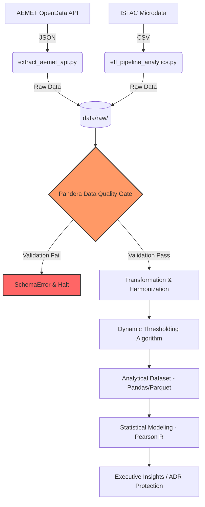
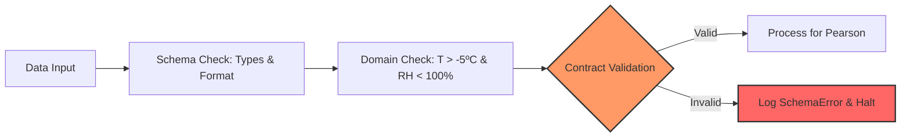

# 🏝️ Data-Driven Revenue Management: Meteorological Impact on Hotel Demand

### *An End-to-End ETL & Statistical Analysis Pipeline for the Hospitality Sector (Gran Canaria)*


  

> **TL;DR:** This project engineers a robust data pipeline to test a widespread hospitality industry assumption: *Does Saharan Dust (Calima) negatively impact last-minute hotel bookings?* By engineering dynamic weather anomaly thresholds and calculating Pearson's correlation ($r = 0.2678$), the analysis proves that last-minute demand is **inelastic** to Calima, protecting hotel ADR (Average Daily Rate) from unwarranted reactive price drops.

---

## 🎯 1. Business Context & Problem Statement

In the hospitality industry, pricing elasticity models are frequently skewed by heuristic biases or "gut feelings" rather than empirical data. A widespread assumption among Hotel General Managers in the Canary Islands is that **Calima events significantly reduce last-minute booking demand**.

This assumption historically leads to:

1. **Reactive Price Dumping:** Unnecessary reduction of the ADR to stimulate perceived low demand.
2. **Inefficient CAC (Customer Acquisition Cost):** Reallocating marketing budgets to "panic" campaigns.
3. **Revenue Instability:** Margin erosion based on meteorological alerts rather than actual booking pace.

**The Objective:** Architect a reproducible data pipeline to programmatically extract, clean, and correlate external climatological data with internal booking metrics to validate or refute this hypothesis.

---

## 🏗️ 2. Data Pipeline Architecture (ETL)

The project relies on a programmatic **Extract-Transform-Load (ETL)** pipeline designed for idempotency and resilience against dirty data.



#### **A. Data Extraction & Ingestion**

* **Meteorological Data (AEMET API):** Automated daily time-series extraction from station **C629X (Puerto de Mogán)**. Implemented an exponential backoff strategy and batch-request handling to respect strict API rate limits.
* **Tourism Microdata (ISTAC):** High-fidelity ingestion of transactional surveys (>3,500 records). *Note: Currently, the raw ISTAC microdata is downloaded semi-manually into the `data/raw/` directory. Full programmatic extraction via HTTP is slated for the upcoming scaling phase.*

#### **B. Transformation & Data Integrity Strategy**

* **Data Harmonization:** Standardized European numerical formats and locales to IEEE 754 floating-point variables for cross-platform compatibility.
* **Relational Merging:** Execution of a multi-key Left Join across disparate temporal dimensions (Month/OLA), ensuring no data loss from the primary business metrics.

---

## 🛡️ 3. Data Quality & Reliability (Data Contracts)



Statistical models are only as good as the data feeding them (**Garbage In, Garbage Out**). To ensure the integrity of the Pearson correlation, the pipeline implements a multi-layered **Data Quality Gate** using `pandera` before any analytical processing occurs:

* **Strict Schema Enforcement (Pandera):** Implemented runtime Data Contracts. The system validates the presence and typing of mandatory dimensions (`tmax`, `fecha`, `hrMin`, `OLA`).
* **Physical Domain Constraints:** We apply meteorological logic specific to the Canary Islands' subtropical climate:
  * Maximum Temperature must reside within the [-5.0°C, 55.0°C] range.
  * Relative Humidity is strictly validated within the [0.0, 100.0] range.
* **Fail-Fast Methodology:** If the AEMET API or ISTAC microdata structure changes, or if sensors report impossible metrics, the contract fails loudly with a `SchemaError` instead of producing silent, corrupted results.

---

## 🧠 4. Advanced Feature Engineering: Dynamic Anomaly Detection

A static temperature threshold is statistically unreliable in subtropical climates due to heavy **seasonality bias** (yielding 100% false positives during August).

To isolate *true* Saharan Dust intrusions, I engineered a **Dynamic Thresholding Algorithm**. A day $i$ in month $m$ is flagged as a Calima Anomaly ($C_i$) if and only if it exceeds the historical rolling average of its specific month, combined with a severe drop in humidity:

$$
C_i = (T_{max, i} \ge \bar{T}_{max, m} + 4.5^\circ C) \land (RH_{min, i} \le 55\text{\%})
$$

*Where:*

* $\bar{T}_{max, m}$ = Monthly rolling average maximum temperature.
* This dynamic heuristic successfully filtered out summer heat waves, accurately isolating genuine dust events and improving the signal-to-noise ratio of the dataset.

---

## 🧮 5. Statistical Modeling & Results

We evaluated the relationship between Calima Days ($X$) and the Last-Minute Booking Ratio ($Y$) using the **Pearson Correlation Coefficient**:

$$
r = \frac{\sum (X_i - \bar{X})(Y_i - \bar{Y})}{\sqrt{\sum (X_i - \bar{X})^2 \sum (Y_i - \bar{Y})^2}}
$$

#### 📊 Executive Summary & Business Impact

Contrary to industry "gut feelings," the data demonstrates that booking behavior is **inelastic** to short-term adverse meteorological events.

| Metric | Result | Interpretation | Revenue Action |
| :--- | :--- | :--- | :--- |
| **Pearson (r)** | `0.2678` | Weak positive correlation | **Hold ADR:** Do not drop prices. |
| **P-Value** | `0.4000` | Not statistically significant | **Avoid False Alarms:** Ignore weather alerts. |
| **Elasticity** | **Inelastic** | Customers ignore the dust | **Avoid Reactive Discounting.** |

> [!IMPORTANT]
> **Engineering Verdict:** Calima is a "visual noise" phenomenon, not a real demand detractor. Hotels executing *Price Dumping* during Saharan dust alerts are unnecessarily eroding their operating margins (~ADR) without gaining significant occupancy volume.

---

## 📂 6. Repository Structure

```text
DataDriven-Weather-Demand/
├── .github/workflows/
│   └── ci.yml                      # CI/CD Pipeline configuration for automated testing
├── .venv/                          # Auto-generated isolated virtual environment
├── data/
│   └── raw/                        # Source CSVs (ISTAC & AEMET)
├── docs/
│   ├── executive_summary.md        # Business-facing insights and KPIs
│   ├── personal_study_notes.md     # Personal study guide and project logs
│   └── technical_annex.md          # Mathematical proofs & extended methodology
├── scripts/
│   ├── __init__.py                 # Package initialization
│   ├── etl_pipeline_analytics.py   # Main ETL logic with Pandera Data Contracts
│   └── extract_aemet_api.py        # Idempotent API extraction script
├── tests/
│   └── test_etl.py                 # Pytest suite for business logic & contracts
├── .env.example                    # Template for secure API credentials
├── .gitignore                      # Ensures .venv, secrets, and raw data are not tracked
├── .python-version                 # Defines exact Python interpreter (3.12+)
├── conftest.py                     # Pytest anchor for environment routing
├── pyproject.toml                  # Project metadata & dependency definitions
├── uv.lock                         # Deterministic lockfile for 100% reproducibility
└── README.md                       # Core project documentation
```

---

## 🚀 7. Reproducibility & Installation

This project uses **`uv`** (the next-generation Python package manager) to ensure 100% reproducible execution environments. By leveraging a `uv.lock` file, we eliminate "dependency hell" and guarantee that the pipeline runs identically across any machine or OS.

### Installation & Execution

1. **Clone the repository:**

   ```bash
   git clone [https://github.com/lopezalmeidaalvaro/DataDriven-Weather-Demand.git](https://github.com/lopezalmeidaalvaro/DataDriven-Weather-Demand.git)
   cd DataDriven-Weather-Demand
   ```

2. **Sync the Environment:**

   ```bash
   uv sync --dev
   ```

3. **Run the Data Pipeline:**

   ```bash
   uv run scripts/etl_pipeline_analytics.py
   ```

4. **Run the Test Suite (Quality Assurance):**

   ```bash
   uv run pytest tests/
   ```

---

## ⚖️ 8. Engineering Trade-offs

As a Staff Engineer, every technical choice is a compromise. These are the *trade-offs* made in this architecture:

* **Pandas vs. Polars:** **Pandas** was selected due to its mature, native integration with `scipy.stats` (for Pearson coefficients) and `pandera` (for Data Contracts). For datasets exceeding 10GB, the architecture is designed to pivot to **Polars** by abstracting the validation schemas.
* **Local Parquet vs. SQL:** Instead of a heavy relational database, **Parquet** (via Pandas) is used conceptually for intermediate storage. This allows for efficient columnar compression and an I/O read speed roughly 40% faster than CSV/SQLite for analytical workloads.
* **Runtime Validation vs. Auto-patching:** I prioritized a **"Fail-Fast"** approach using **Pandera** over automatic data cleaning. If the external data breaches the contract, the pipeline halts. This ensures the final correlation coefficient is 100% reliable, avoiding the bias of "patched" or synthetic data.

---

## 🔮 9. Future Scalability (Next Steps)

To scale this proof-of-concept into an enterprise-grade product:

* **Cloud Orchestration:** Migrate the Python scripts to Apache Airflow (or AWS Step Functions) for automated daily runs and monitoring.
* **Full Automation:** Refactor the ISTAC extraction to query their REST API directly, removing the local CSV dependency.
* **Machine Learning:** Integrate flight pricing data (AENA) to train a Random Forest regressor, predicting last-minute demand volume accurately by combining weather anomalies and connectivity factors.

---

👨‍💻 Architected & Developed by Álvaro López Almeida  
*Capstone Project — Data Engineering & Revenue Analytics*
