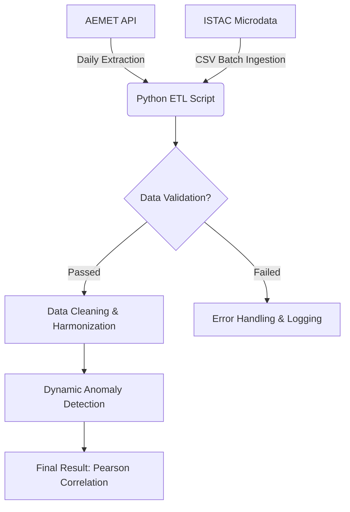

# 🏝️ Data-Driven Revenue Management: Meteorological Impact on Hotel Demand
### *An End-to-End ETL & Statistical Analysis Pipeline for the Hospitality Sector (Gran Canaria)*

    

> **TL;DR:** This project engineers a robust data pipeline to test a widespread hospitality industry assumption: *Does Saharan Dust (Calima) negatively impact last-minute hotel bookings?* By engineering dynamic weather anomaly thresholds and calculating Pearson's correlation ($r = 0.268$), the analysis proves that last-minute demand is **inelastic** to Calima, protecting hotel ADR (Average Daily Rate) from unwarranted reactive price drops.

---

## 🎯 1. Business Context & Problem Statement

In the hospitality industry, pricing elasticity models are frequently skewed by heuristic biases or "gut feelings" rather than empirical data. A widespread assumption among Hotel General Managers in the Canary Islands is that **Calima events significantly reduce last-minute booking demand**. 

This assumption historically leads to:
1. **Reactive Price Dumping:** Unnecessary reduction of the ADR to stimulate perceived low demand.
2. **Inefficient CAC (Customer Acquisition Cost):** Reallocating marketing budgets to "panic" campaigns.
3. **Revenue Instability:** Margin erosion based on meteorological alerts rather than actual booking pace.

**The Objective:** Architect a reproducible data pipeline to programmatically extract, clean, and correlate external climatological data with internal booking metrics to validate or refute this hypothesis.

---

## 🏗️ 2. Data Pipeline Architecture (ETL)
The project relies on a programmatic **Extract-Transform-Load (ETL)** pipeline designed for idempotency and resilience against dirty data.

### A. Data Extraction
* **Meteorological Data (AEMET OpenData API):** Automated extraction of daily time-series weather data from station `C629X` (Puerto de Mogán). Implemented batch-request handling to bypass strict API rate limits.
* **Tourism Microdata (ISTAC):** Batch ingestion of large-scale transactional surveys (>3,500 individual records). Filtered specifically for the 4-star hotel segment in Gran Canaria to ensure parity with the target business model.

### B. Transformation & Schema Drift Mitigation
* **Data Harmonization:** Type-casting European numerical formats to standard floating-point variables.
* **Resilient Aggregation:** Implemented robust counting strategies (`.size()` vs `.count()`) to mitigate **Schema Drift**. This prevented critical pipeline failures caused by inconsistently reported questionnaire IDs (Nulls) across different quarters.
* **Relational Merging:** Conducted a Left Join unifying disparate datasets via a shared temporal dimension (`Month/OLA`).



---

## 🛡️ 3. Data Quality & Reliability (Data Contracts)

Statistical models are only as good as the data feeding them (**Garbage In, Garbage Out**). To ensure the integrity of the Pearson correlation ($r$), the pipeline implements a multi-layered **Data Quality Gate** before any analytical processing occurs:

* **Schema Enforcement & Drift Protection:** The system validates the presence of mandatory dimensions (`tmax`, `fecha`, `hrMin`) and metrics. This acts as a contract, ensuring that if the AEMET API or ISTAC microdata structure changes, the pipeline fails loudly with a descriptive error instead of producing silent, corrupted results.
* **Physical Domain Constraints:** We apply meteorological logic specific to the Canary Islands' subtropical climate. 
    * $T_{max}$ must reside within the [-5°C, 55°C] range.
    * Relative Humidity ($RH$) is strictly validated within the [0, 100] range.
    * Records outside these bounds are flagged as sensor malfunctions and sanitized to prevent outlier bias.
* **Reliability Thresholding (Null Handling):** The pipeline monitors the "Signal-to-Noise" ratio. If the temporal series identifies more than 10% of missing values (**Critical Nulls**), the execution halts. This prevents the Monthly Average from being skewed by incomplete time windows.
* **Idempotent Extraction:** The `extract_aemet_api.py` script is designed for idempotency. It verifies the local state of the `data/raw/` directory before initiating network requests, protecting API quotas and ensuring the pipeline is safely re-runnable in any environment.

---

## 🧠 4. Advanced Feature Engineering: Dynamic Anomaly Detection
A static temperature threshold (e.g., $T > 27.5^\circ C$) is statistically unreliable in subtropical climates due to heavy **seasonality bias** (yielding 100% false positives during August).

To isolate *true* Saharan Dust intrusions, I engineered a **Dynamic Thresholding Algorithm**. A day $i$ in month $m$ is flagged as a Calima Anomaly ($C_i$) if and only if it exceeds the historical rolling average of its specific month, combined with a severe drop in humidity:

$$
C_i = (T_{max, i} \ge \bar{T}_{max, m} + 4.5^\circ C) \land (RH_{min, i} \le 55\text{\%})
$$

*Where:*
* $\bar{T}_{max, m}$ = Monthly rolling average maximum temperature.
* This dynamic heuristic successfully filtered out summer heat waves, accurately isolating genuine dust events and improving the signal-to-noise ratio of the dataset.

---

## 🧮 5. Statistical Modeling & Results
We evaluated the relationship between Calima Days ($X$) and the Last-Minute Booking Ratio ($Y$) using the **Pearson Correlation Coefficient**:

$$
r = \frac{\sum (X_i - \bar{X})(Y_i - \bar{Y})}{\sqrt{\sum (X_i - \bar{X})^2 \sum (Y_i - \bar{Y})^2}}
$$

### 📊 Key Findings

| Metric | Result | Statistical Interpretation | Business Translation |
| :--- | :---: | :--- | :--- |
| **Pearson ($r$)** | `0.268` | Weak positive correlation. | Weather does not deter impulsive buyers. |
| **Null Hypothesis** | Retained | Variables are largely independent. | Dust events do not drive cancellations. |
| **Revenue Risk** | Minimal | Demand is inelastic to this factor. | Price drops during Calima are unjustified. |

> **Executive Conclusion:** Short-term booking demand in Gran Canaria is statistically insensitive to Saharan Dust events. Hotels reacting with price reductions during Calima alerts are sacrificing revenue margin unnecessarily.

---

## 📂 6. Repository Structure 

```text
DataDriven-Weather-Demand/
├── .venv/                          # Auto-generated isolated virtual environment
├── data/
│   └── raw/                        # Source CSVs (ISTAC & AEMET)
├── docs/
│   ├── executive_summary.md        # Business-facing insights
│   ├── personal_study_notes.md     # Personal study guide
│   └── technical_annex.md          # Mathematical proofs & methodology
├── scripts/
│   ├── etl_pipeline_analytics.py   # Main ETL logic with Data Quality Gates
│   └── extract_aemet_api.py        # Idempotent API extraction script
├── .env.example                    # Template for API credentials
├── .gitignore                      # Ensures .venv and secrets are not tracked
├── .python-version                 # Defines exact Python interpreter (3.12+)
├── pyproject.toml                  # Project metadata & dependency definitions
├── uv.lock                         # Deterministic lockfile for 100% reproducibility
└── README.md                       # Core project documentation
```

---

## 🚀 7. Reproducibility & Installation
This project uses **`uv`** (the next-generation Python package manager) to ensure 100% reproducible execution environments. By leveraging a `uv.lock` file, we eliminate "dependency hell" and guarantee that the pipeline runs identically across any machine or OS.

### Installation & Execution

1. **Clone the repository:**
   ```bash
   git clone [https://github.com/lopezalmeidaalvaro/DataDriven-Weather-Demand.git](https://github.com/lopezalmeidaalvaro/DataDriven-Weather-Demand.git)
   cd DataDriven-Weather-Demand
   ```
2. **Sync the Environment:**
If you have uv installed, simply run:
 ```bash
  uv sync
   ```
This command automatically creates a virtual environment (.venv) and installs the exact versions of all dependencies (Pandas, Requests, etc.) in milliseconds.
3. **Run the Data Pipeline:**
 ```bash
  uv run scripts/etl_pipeline_analytics.py
   ```
Engineering Note: For legacy environments, a standard requirements.txt can be generated using uv export --format requirements-txt > requirements.txt, although using the native uv.lock is the recommended professional standard for deterministic builds.

---

## 🔮 8. Future Scalability (Next Steps)
To scale this proof-of-concept into an enterprise-grade product:
* **Cloud Orchestration:** Migrate the Python scripts to Apache Airflow (or AWS Step Functions) for automated daily runs and monitoring.
* **Machine Learning:** Integrate flight pricing data (AENA) to train a Random Forest regressor, predicting last-minute demand volume accurately by combining weather anomalies and connectivity factors.

---

👨‍💻 Architected & Developed by Álvaro López Almeida
Capstone Project — Data Engineering & Revenue Analytics
